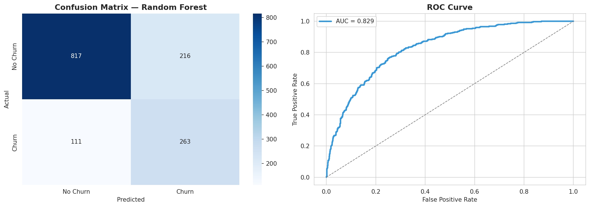
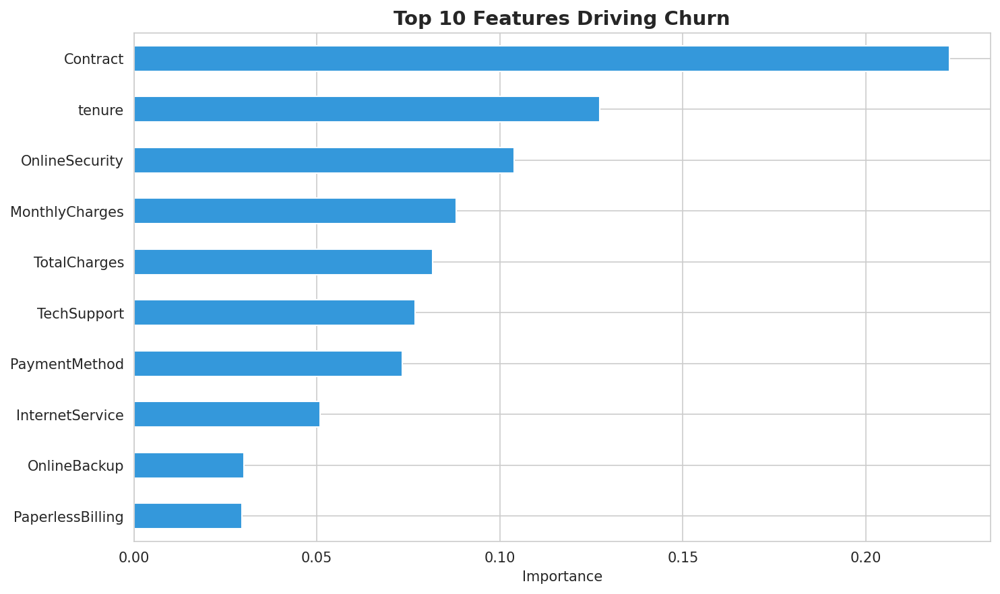

# Customer Churn Prediction

Predicts customer churn for a telecom company using machine learning, 
achieving 77% accuracy and 0.83 ROC-AUC with proper handling of class imbalance.

## Problem
Telecom companies lose significant revenue to customer churn. This project 
identifies customers at risk of leaving so retention efforts can be targeted 
before they churn.

## Approach
- Data cleaning and preprocessing
- Exploratory data analysis
- Class imbalance handled via SMOTE
- Compared Logistic Regression vs Random Forest
- Full evaluation: accuracy, F1, ROC-AUC, confusion matrix
- Feature importance analysis for business insight

## Results

**Random Forest (best model):**
- Accuracy: 77%
- F1-Score: 0.62
- ROC-AUC: 0.83
- Recall on churn class: 70% (catches 7 of 10 customers who will actually churn)

**Top churn drivers identified:**
Contract type was the single strongest predictor — more than 2x the next 
most important feature — followed by tenure and online security status.

## Tech Stack
Python · Scikit-learn · Pandas · Imbalanced-learn (SMOTE) · Seaborn

## Try It
View the full notebook on [Kaggle](https://www.kaggle.com/code/aseermuntaqueemarko/customer-churn-prediction-ml-pipeline-with-smote) 
or open `notebook.ipynb` here in Jupyter/Colab.

Dataset: [Telco Customer Churn (Kaggle)](https://www.kaggle.com/datasets/blastchar/telco-customer-churn)
